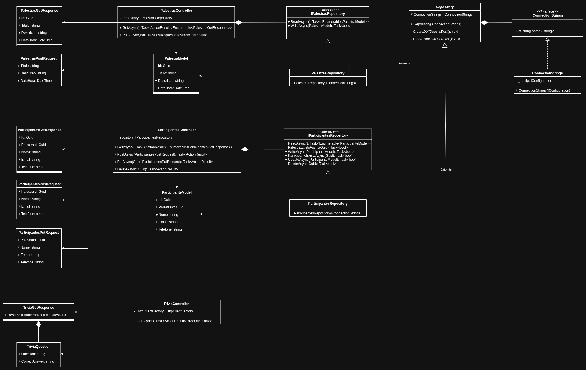
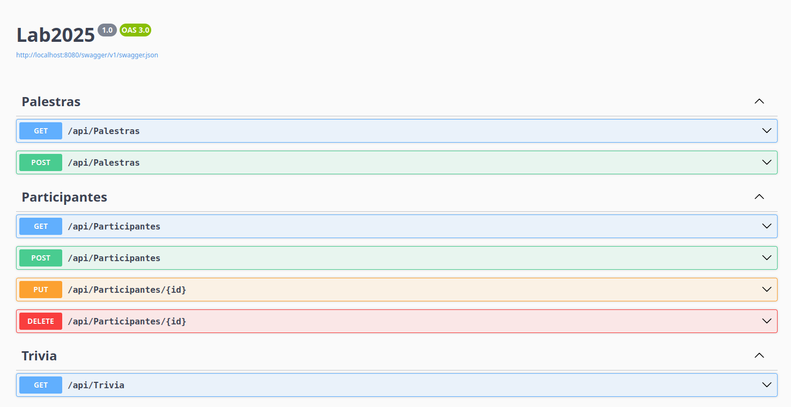

# F&MD Lab 2025

API de cadastro de palestras e participantes desenvolvido para um teste técnico da empresa F&MD.

## Como executar

### Pré-requisitos

- Docker Desktop configurado para usar no mínimo 2GB de RAM;

### Instruções

Assegure que o Docker está rodando e siga os seguintes passos:
1. Clone o repositório do projeto:
```bash
git clone https://github.com/marvipi-dev/femd-lab2025.git
```
2. Entre na pasta raiz do projeto (onde se encontra o arquivo compose.yml):
```bash
cd femd-lab2025
```
3. Compile o projeto com o Docker Compose:
```bash
docker compose build
```
4. Rode o projeto com o Docker Compose:
```bash
docker compose up
```

## Design


## Endpoints


